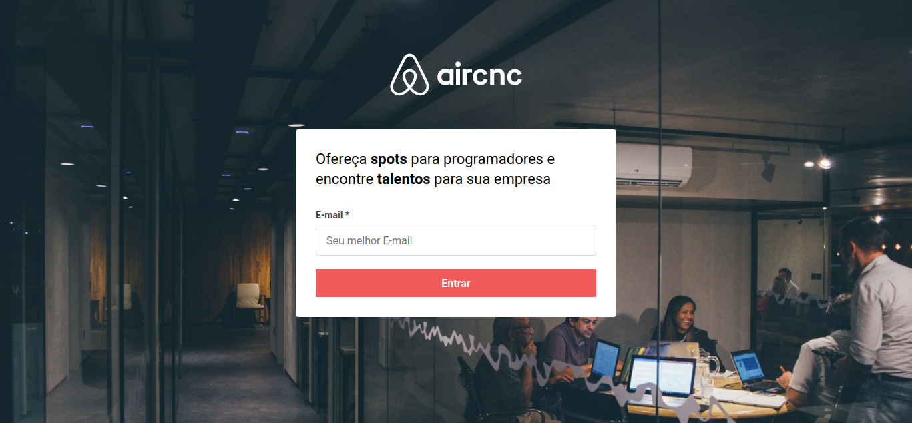
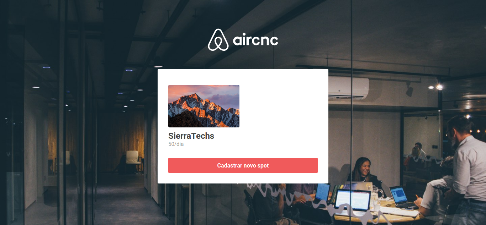
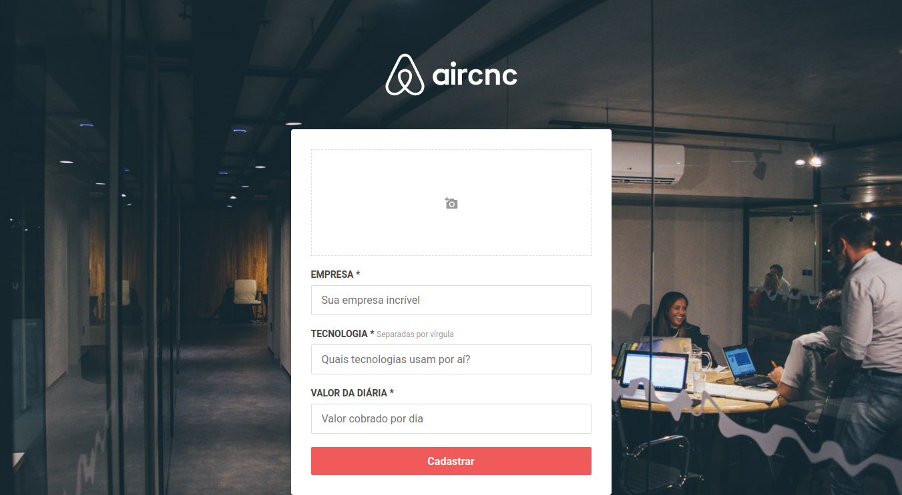
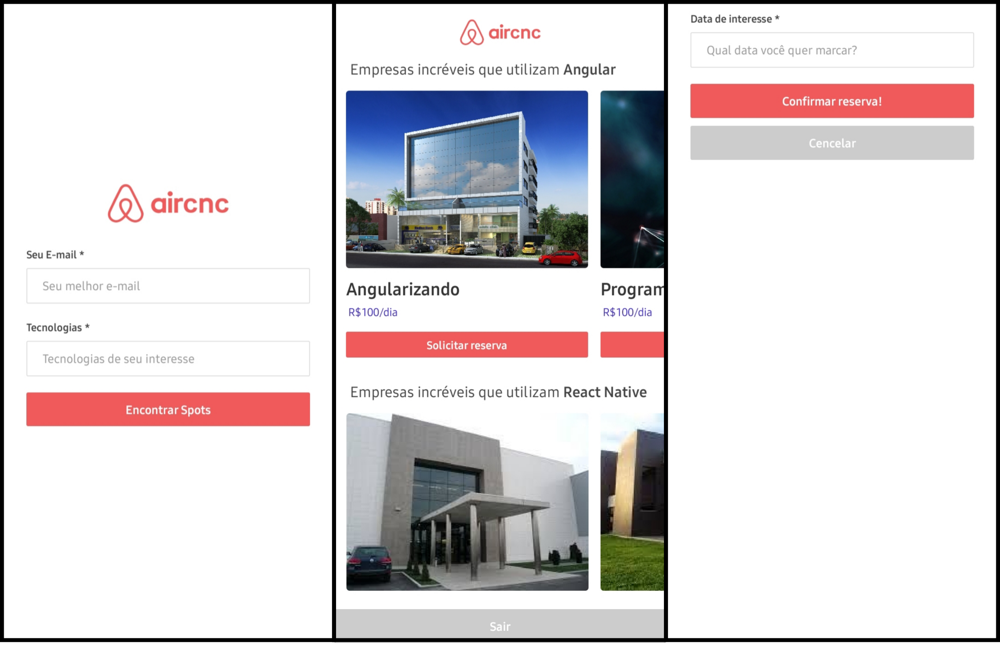

# AirCNC - Spots to programmer

#### A proposta é que empresas possam oferecer a nós, programadores, a possibilidade de ambientes voltados a programação, viabilizando um network de toda comunidade, bem como, encontre talentos para sua empresa.

##### Tecnologias utilizadas: *React, React Native e NodeJs.*

##### Front-end web:

##### Mobile:

***

##Build project
